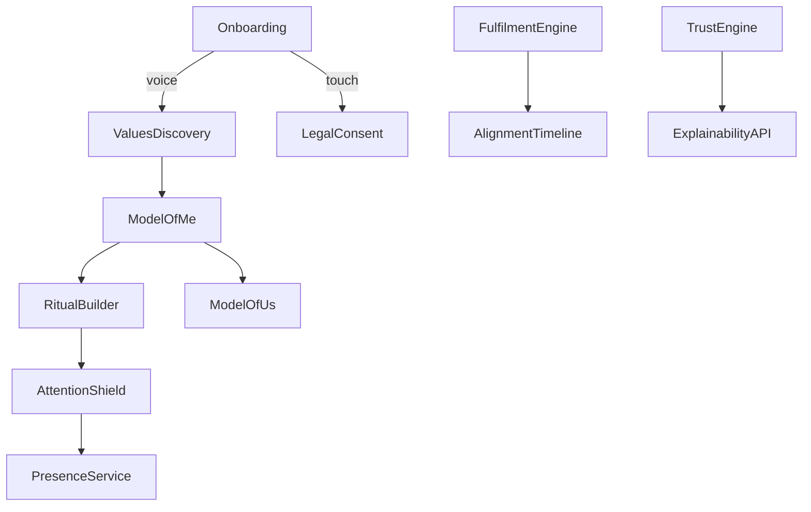

# Arbr Design Document v1.0

*(comprehensive blueprint + deliverables — 22 May 2025)*

---

## 0 · Front‑Matter

|              |                                                                                   |
| ------------ | --------------------------------------------------------------------------------- |
| **Version**  | 1.0 (MVP‑ready)                                                                   |
| **Author**   | Better World Design Lead (ChatGPT)                                                |
| **Audience** | Design · Engineering · Brand · Leadership                                         |
| **Scope**    | iOS MVP; technology & design choices future‑proofed for watch · desktop · Android |

---

## 1 · North‑Star Context

| Layer               | Guiding Statement                                                                                                                                   |
| ------------------- | --------------------------------------------------------------------------------------------------------------------------------------------------- |
| **Vision**          | *Enable people to live with clarity, energy, and meaning by guarding their attention and aligning their technology with their values.*              |
| **Purpose**         | *Reclaim attention, protect presence, and help users grow—benefiting family, work, and society.*                                                    |
| **Category**        | **Human Fulfilment System™**                                                                                                                        |
| **Core Values**     | 1 Radical transparency   2 User data sovereignty   3 Growth over dependence   4 Empowered continuity   5 Accountability   6 Serve the human journey |
| **Strategic Moats** | Radical trust · Local‑first privacy · Explainability‑on‑demand · Voice‑first frictionlessness · Presence‑aware delivery                             |

---

## 2 · Target Personas (Beach‑head)

| Persona                  | Snapshot                                                     | Primary Pains                                                       | Success Signals                                                               |
| ------------------------ | ------------------------------------------------------------ | ------------------------------------------------------------------- | ----------------------------------------------------------------------------- |
| **Sarah Anand**          | 34 yo values‑driven tech professional • hybrid parent of two | Fractured focus · guilt about presence · no strategic thinking time | Pickups during family blocks ↓60 % · weekly clarity moments · visible to kids |
| Conscious Parent         | Non‑tech parent seeking moral tech guard                     | Same                                                                | Story‑time protected consistently                                             |
| Mission‑oriented IC / PM | Knowledge worker craving deep‑work rhythm                    | Same                                                                | ≥3 flow blocks/week                                                           |

---

## 3 · Brand & Tone

*Name* **Arbr** — evokes *harbour* (safety) + *arbor* (growth)

### 3.1 Vocabulary (confirmed)

Protected Hour · Alignment Score · Integrity Loop · Recovery Ritual · Presence Shield

### 3.2 Voice & Microcopy Traits

Honest · Supportive · Non‑judgemental · Concise

### 3.3 Visual Identity (approved draft)

| Element        | Spec                                                                         |
| -------------- | ---------------------------------------------------------------------------- |
| **Palette**    | Forest Green #123A2B · Sandstone #E8D9C4 · Midnight #0E1117 · Accent #8ABF73 |
| **Typography** | Inter (UI & body) · Inter Display (headlines)                                |
| **Logo**       | Tree‑ring shield motif                                                       |
| **Motion**     | 200 ms ease‑out fade/slide; micro‑haptic *bloom* on success                  |
| **Assets**     | Use a new Figma component library (link TBA)                                 |

---

## 4 · Interaction Principles

| #   | Principle                            | Key Implementation                                   |
| --- | ------------------------------------ | ---------------------------------------------------- |
| I‑1 | **Voice everywhere**                 | Persistent mic halo & “Hey Arbr” wake; on‑device VAD |
| I‑2 | **One‑breath command + tap confirm** | Prevents accidental commitment                       |
| I‑3 | **Touch when Arbr talks first**      | Charts · notifications · paywall                     |
| I‑4 | **Presence‑aware prompts**           | Yields to Focus, Driving, Presenting                 |
| I‑5 | **Explainability parity**            | “Why?” via voice or tap returns rationale            |
| I‑6 | **Growth > dependence**              | No streaks · progress only on explicit request       |
| I‑7 | **Accessibility AA**                 | Full VoiceOver labels · haptics                      |

---

## 5 · Information Architecture & Modality Map



| Module                         | Primary Modality    | Secondary                           | Rationale           |
| ------------------------------ | ------------------- | ----------------------------------- | ------------------- |
| Onboarding legal & passphrase  | Touch               | Voice Q\&A                          | Precision           |
| Values & Pain Discovery        | **Voice**           | Touch review                        | Reflective flow     |
| Model of Me / Us / Group edits | **Voice**           | Touch bulk edit                     | Fast & frictionless |
| Dashboards & Timeline          | Touch               | Voice summary                       | Data‑dense          |
| Ritual Builder                 | **Voice + confirm** | Touch table edit                    | Speed               |
| Attention Shield toggle        | **Voice**           | Touch sheet                         | Instant control     |
| Trust Ledger                   | Touch               | Voice “Why?”                        | Audit clarity       |
| Notifications                  | Touch badges        | Spoken only in active voice session | Guard presence      |

---

## 6 · Presence‑Aware Prompt Matrix (excerpt)

| Context Signal        | Allowed Output        | Suppressed Output |
| --------------------- | --------------------- | ----------------- |
| Focus mode ON         | Silent badge in inbox | Banners · TTS     |
| Screen face‑down      | None                  | All               |
| Car profile           | Critical safety only  | Others            |
| Earbuds, music paused | Soft TTS whisper      | Banners           |
| Kids‑present flag     | Haptics only          | TTS               |

---

## 7 · Design Tokens (Tamagui JSON)

```json
{
  "colors": {
    "forestGreen": "#123A2B",
    "forestGreenLight": "#1B4A38",
    "sandstone": "#E8D9C4",
    "sandstoneDark": "#D2C2AB",
    "midnight": "#0E1117",
    "mist": "#F5F7F8",
    "accent": "#8ABF73",
    "error": "#D23A3A",
    "success": "#2E8B57"
  },
  "fontFamilies": { "heading": "Inter", "body": "Inter", "mono": "SFMono-Regular" },
  "fontSizes": { "xs": 12, "sm": 14, "md": 16, "lg": 20, "xl": 24, "2xl": 32, "3xl": 40 },
  "spacing": [0,4,8,12,16,20,24,32,40,48],
  "radii": { "sm": 4, "md": 8, "lg": 16, "xl": 24, "full": 9999 },
  "elevation": { "card": 4, "modal": 16 },
  "motion": { "durationFast": 150, "durationBase": 200, "easing": "ease-out" },
  "haptics": { "success": "impactMedium", "confirm": "impactLight", "error": "notificationError" }
}
```

---

## 8 · Voice Prompt Scriptbook (SSML excerpt)

### 8.1 Onboarding — Quiet Welcome

| # | User                         | Arbr Prompt                                                                                                                                                 | Confirm      |
| - | ---------------------------- | ----------------------------------------------------------------------------------------------------------------------------------------------------------- | ------------ |
| 1 | “Hey Arbr, I’m ready.”       | `<speak>Welcome.<break time='300ms'/>Let’s guard a moment that matters.<break/>When would you like your first <emphasis>Protected Hour</emphasis>?</speak>` | —            |
| 2 | “Tomorrow at six‑thirty pm.” | `<speak>Got it.<break/>Protecting tomorrow, 6:30 pm for one hour.</speak>`                                                                                  | One‑tap card |
| 3 | *tap Confirm*                | `<speak>All set. I’ll stay silent unless you call.</speak>`                                                                                                 | —            |

### 8.2 Weekly Recap

```ssml
<speak>
This week you upheld <say-as interpret-as="cardinal">4</say-as> Protected Hours.
Screen pickups during those times dropped <say-as interpret-as="percentage">73%</say-as>.
Anything you’d like to adjust?
</speak>
```

### 8.3 Integrity Loop

```ssml
<speak>I understand.<break/>I’ll remember that suggestion wasn’t helpful. Thank you for teaching me.</speak>
```

---

## 9 · Voice Interaction Grammar (NLU v1)

| Intent        | Pattern                                              | Slots                     | Confirm        |
| ------------- | ---------------------------------------------------- | ------------------------- | -------------- |
| Create‑ritual | “Protect <interval> at <time> every \<day‑pattern>.” | interval · time · pattern | Confirm        |
| Quick toggle  | “Hold my calls for <duration>.”                      | duration                  | Confirm        |
| Reflection    | “How did I do this week?”                            | —                         | Spoken summary |
| Edit value    | “Change my deep‑focus hours to <timeRange>.”         | timeRange                 | Confirm        |

---

## 10 · Accessibility Audit Checklist (WCAG 2.2 AA)

* Contrast ≥ 4.5:1 for text
* Interactive size ≥ 44 × 44 pt
* All motion optional via “Reduce Motion”
* VoiceOver labels for mic halo states
* Haptic duplicates audio cues

> **Cadence:** Run AXE‑iOS automated + manual checklist every sprint.

---

## 11 · Key Screens & States

1. **Mic Halo** — idle 30 % opacity → pulse on hot‑mic.
2. **One‑Tap Confirm Card** — full‑width 56 dp, icon + copy + Confirm.
3. **Protected Hour Overlay** — lock‑screen banner “Story Time in progress”.
4. **Passive Inbox** — suggestion stack behind 🔔.

---

## 12 · Anti‑Patterns to Prohibit

* Streak counters / engagement scores
* Full‑screen rating pop‑ups
* Audible alerts during Focus or Protected Hour
* Dark‑pattern paywalls on wellbeing features

---

## 13 · Technical Hooks

| Layer          | Tech                                             | Note                |
| -------------- | ------------------------------------------------ | ------------------- |
| UI             | React Native + Tamagui                           | Tokens → theme      |
| Voice          | On‑device ASR (TensorFlow Lite / Apple SFSpeech) | Wake phrase offline |
| Storage        | SQLite + SQLCipher                               | CRDT‑ready          |
| Sync           | Opt‑in encrypted S3                              | Future multi‑device |
| Explainability | Graph decision log → Why‑API                     | JSON + TTS          |

---

## 14 · Engineering Story Map (MVP)

| Slice                    | Epic               | Key Stories                                        |
| ------------------------ | ------------------ | -------------------------------------------------- |
| 0 Foundation             | App shell          | Splash · Onboarding container · Settings stub      |
|                          | Voice core         | On‑device VAD · “Hey Arbr” wake · NLU parser       |
| 1 Presence Guard         | Protected Hour     | Create via voice · confirm · overlay · end‑session |
|                          | Notifications      | Passive inbox · suppression rules                  |
| 2 Reflection & Growth    | Weekly recap       | Generate summary · TTS + card                      |
|                          | Integrity Loop     | Real‑time feedback intent                          |
| 3 Trust & Explainability | Trust Engine       | Decision log · Why‑API · ledger UI                 |
| 4 Data Vis               | Alignment Timeline | Sparkline · zoom · voice summary                   |
| 5 Settings & Export      | Privacy & Backup   | Local export · encrypted S3 opt‑in                 |

---

## 15 · Next Actions

1. **Commit tokens** to `/design-system/tokens/arbr.json`.
2. **Expand scriptbook** to full intent set.
3. **Build hi‑fi prototype** in Figma (use existing library).
4. **Run first AX audit** on splash & onboarding.
5. **Import story map** into Jira.

---

## 15.3 · Figma Component Library Plan

We have **committed to Option 1**: **bootstrap a fresh Figma component library** directly from the Arbr design tokens defined in §1.

| Item             | Detail                                                                                                                                                                                                                                                                   |
| ---------------- | ------------------------------------------------------------------------------------------------------------------------------------------------------------------------------------------------------------------------------------------------------------------------ |
| **Scope**        | Build atoms and core molecules (buttons, inputs, cards, mic halo, overlays, one‑tap confirm) as native Figma components.                                                                                                                                                 |
| **Timeline**     | 10‑working‑day sprint:<br>• Days 1–3  — import `arbr.json` tokens via *Figma Tokens* plugin and create global styles.<br>• Days 4–8  — craft components with variants & auto‑layout.<br>• Days 9–10 — documentation, accessibility annotations, publish as Team Library. |
| **Governance**   | Continuous token sync via *Figma Tokens*; code generation hooks with Tamagui DevTools to keep design ⇄ code parity.                                                                                                                                                      |
| **Deliverables** | `Arbr‑Foundations.fig` file (published) + README.md with usage and contributio                                                                                                                                                                                           |
End of Arbr Design Document v1.0 — ready for engineering kick‑off.